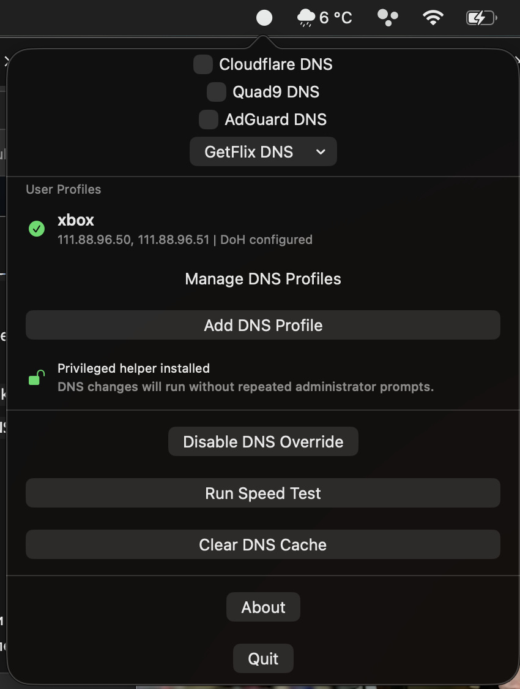

# DNS Easy Switcher

A modified macOS menu bar utility for switching DNS profiles quickly.

This project is based on [`glinford/dns-easy-switcher`](https://github.com/glinford/dns-easy-switcher) and keeps the original MIT license.



<details>
<summary>Русская версия описания</summary>

## Что делает приложение

DNS Easy Switcher Fork — модифицированная macOS-утилита в menu bar для быстрого переключения DNS-профилей.

Основные возможности:

- Переключение DNS прямо из menu bar.
- Встроенные провайдеры DNS:
  - Cloudflare
  - Quad9
  - AdGuard
  - GetFlix
- Пользовательские DNS-профили с связанными настройками:
  - имя профиля
  - основной IPv4 DNS
  - дополнительный IPv4 DNS
  - DNS-over-HTTPS URL
- Пользовательские профили отображаются сразу в основном меню.
- Обычный клик по иконке включает или выключает выбранный пользовательский профиль.
- Нажатие двумя пальцами / secondary click по иконке открывает меню.
- Иконка в menu bar меняется в зависимости от состояния DNS.
- При выключении DNS override приложение возвращает DNS в automatic/default режим.
- Добавлен privileged helper: после установки/подтверждения helper-а DNS можно переключать без повторного запроса прав администратора.
- Есть тест скорости DNS и очистка DNS cache.

## Статус DNS-over-HTTPS

DNS-over-HTTPS сейчас хранится и валидируется как часть пользовательского профиля, но системное применение DNS выполняется через macOS `networksetup`. Этот механизм применяет обычные DNS-серверы и не настраивает системные encrypted DNS/DoH профили.

То есть в текущей версии DoH URL не подделывается: он сохраняется в профиле, но реально применяются только IPv4 DNS-серверы.

Если fork получит достаточный отклик и обратную связь, я планирую купить Apple Developer подписку и продолжить работу над полноценным переключением DoH-профилей через корректную macOS-подпись и системную интеграцию.

## Установка

1. Скачайте `.dmg` из Releases.
2. Откройте DMG.
3. Перетащите `DNS Easy Switcher.app` в `/Applications`.
4. Запустите приложение.
5. Установите или подтвердите privileged helper, если macOS попросит это сделать.

Сборка сейчас подписана ad-hoc и не notarized, поэтому при первом запуске macOS может потребовать открыть приложение через right-click → Open.

</details>

## What It Does

- Switches DNS from the macOS menu bar.
- Supports built-in DNS providers:
  - Cloudflare
  - Quad9
  - AdGuard
  - GetFlix
- Supports user DNS profiles with linked settings:
  - profile name
  - primary IPv4 DNS
  - secondary IPv4 DNS
  - DNS-over-HTTPS URL
- Shows user profiles directly in the main menu.
- Uses a menu bar icon state:
  - filled circle when DNS override is enabled
  - normal network icon when DNS override is disabled
- Single click toggles the selected user profile on/off.
- Two-finger click / secondary click opens the menu.
- Resets DNS back to automatic/default when the override is disabled.
- Includes DNS speed testing and DNS cache flushing.

## Privileged Helper

This version adds a privileged helper so DNS changes do not need to request administrator permission every time.

The intended flow is:

1. Install or approve the helper once.
2. The app communicates with the helper through XPC.
3. The helper runs `networksetup` as root.
4. Future DNS changes happen without repeated admin prompts.

If the helper is not installed or macOS requires approval, the menu shows the helper status and an action button. The app keeps a fallback path through the old administrator prompt so DNS switching still works even before the helper is active.

## DNS-over-HTTPS Status

DNS-over-HTTPS is stored as part of each user profile and validated as an HTTPS URL.

Important: the current DNS application path uses macOS `networksetup`, which applies classic DNS servers. `networksetup` does not configure encrypted DNS/DoH system profiles. Therefore, this app currently stores and displays the DoH URL but applies the IPv4 DNS servers only.

If this fork gets enough interest and feedback, I plan to buy an Apple Developer subscription and continue the work toward fully working DoH profile switching with the proper macOS signing and system integration flow.

## Installation

1. Download the latest `.dmg` from Releases.
2. Mount the DMG.
3. Drag `DNS Easy Switcher.app` to `/Applications`.
4. Launch the app.
5. Approve or install the privileged helper when prompted or from the app menu.

Since this is distributed outside the Mac App Store, macOS may show a Gatekeeper warning on first launch. If the app is not notarized, use right-click → Open for the first launch.

## Build From Source

Requirements:

- macOS 14.0 or later
- Xcode 15 or later

Build:

```bash
xcodebuild \
  -project "DNS Easy Switcher.xcodeproj" \
  -scheme "DNS Easy Switcher" \
  -configuration Debug \
  -derivedDataPath build/DerivedData \
  CODE_SIGNING_ALLOWED=NO \
  build
```

Create a local DMG:

```bash
APP_PATH="dist/DNS Easy Switcher.app"
DMG_STAGING="build/dmg-staging"
DMG_PATH="dist/DNS Easy Switcher.dmg"

rm -rf "$DMG_STAGING" "$DMG_PATH"
mkdir -p "$DMG_STAGING"
ditto "$APP_PATH" "$DMG_STAGING/DNS Easy Switcher.app"
ln -s /Applications "$DMG_STAGING/Applications"
hdiutil create -volname "DNS Easy Switcher" -srcfolder "$DMG_STAGING" -ov -format UDZO "$DMG_PATH"
```

## Release Notes For This Modified Version

- Added linked user DNS profiles with `primaryIPv4`, `secondaryIPv4`, and `dnsOverHttps`.
- Added validation for IPv4 DNS addresses and DNS-over-HTTPS URLs.
- Added direct profile display in the menu bar menu.
- Added single-click toggle for the selected user profile.
- Menu opens with two-finger click / secondary click on the menu bar icon.
- Added dynamic menu bar icon state.
- Added privileged helper support to avoid repeated administrator prompts.
- Kept DoH honest: stored and validated, but not applied through `networksetup`.

## Privacy

DNS Easy Switcher does not collect analytics or send app data to external services. Settings are stored locally on the Mac.

## License

This project is licensed under the MIT License. See [LICENSE](LICENSE).
